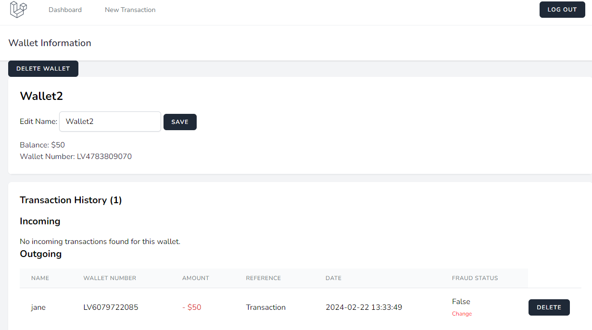

# Virtual Wallet App

This application provides financial functionalities to manage your wallets, perform and handle transactions. 

## Features

### Wallet Management

- **Create Wallets**: Users can create different wallets to manage their funds efficiently.

### Transactions

- **Make Transactions**: Perform transactions between different wallets with other users.
- **Transaction History**: Review and track the history of transactions made across wallets.

## To run Virtual Wallet application in your server, you'll need 

#### PHP (version 7.4 or higher)
#### Composer
#### MySQL or a database of your choice
#### npm

1. **Clone the repository**:
    - Git clone ..

2. **Install Dependencies**:
    - composer install
    - npm install
    - npm run dev

3. **Set up environment**:
    - set up .env (recreate .env.example and add your database information)
    - php artisan key:generate

4. **Setup database**:
    - php artisan migrate

5. **Start application**:
    - php artisan serve

